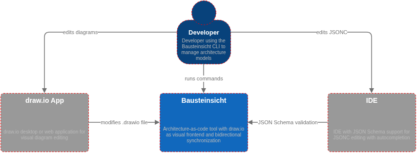

= Bausteinsicht

Architecture-as-code tool with https://www.drawio.com/[draw.io] as visual frontend and bidirectional synchronization.

Define your architecture in a JSONC text file, and Bausteinsicht generates and updates draw.io diagrams automatically — in both directions.

=== Example: JSON in, diagram out

This JSONC model produces the diagram above:

[source,jsonc]
----
{
  "specification": {
    "elements": {
      "actor":    { "notation": "Actor" },
      "system":   { "notation": "Software System", "container": true },
      "container": { "notation": "Container", "container": true }
    },
    "relationships": {
      "uses": { "notation": "uses" }
    }
  },
  "model": {
    "customer": { "kind": "actor", "title": "Customer" },
    "onlineshop": {
      "kind": "system", "title": "Online Shop",
      "children": {
        "frontend": { "kind": "container", "title": "Web Frontend", "technology": "React" },
        "api":      { "kind": "container", "title": "REST API", "technology": "Go" },
        "db":       { "kind": "container", "title": "Database", "technology": "PostgreSQL" }
      }
    }
  },
  "views": {
    "context":    { "title": "System Context", "include": ["customer", "onlineshop"] },
    "containers": { "title": "Container View", "scope": "onlineshop", "include": ["customer", "onlineshop.*"] }
  }
}
----

=== Jobs to be Done

**Define architecture in text, get diagrams automatically** — write a JSONC model and run `bausteinsicht sync`.
See the link:src/docs/spec/06_tutorial.adoc[Getting Started Tutorial].

**Edit diagrams visually, keep the model in sync** — move boxes in draw.io and sync changes back to JSON.
See the link:src/docs/spec/05_sync_specification.adoc[Sync Specification].

**Navigate multi-level views like a map** — zoom into a system to see its containers, then into a container to see components.
See the link:src/docs/manual/user-manual.adoc#multi-view[User Manual — Multi-View].

**Let AI agents modify your architecture** — every CLI command supports `--format json` for LLM-driven workflows.
See the link:src/docs/manual/user-manual.adoc#llm-workflows[User Manual — LLM Workflows].

== Quick Start

[source,bash]
----
# Build from source
go build -o bausteinsicht ./cmd/bausteinsicht/

# Initialize a sample project
mkdir my-architecture && cd my-architecture
bausteinsicht init
----

`bausteinsicht init` creates a sample JSONC model (`architecture.jsonc`) and a default template — everything you need to get started.
Now run sync to generate diagrams:

[source,bash]
----
bausteinsicht sync
----

Open `architecture.drawio` in draw.io to see the generated diagrams.
Edit the JSONC model or the draw.io file and run `sync` again — changes flow in both directions.

For continuous sync on save, use watch mode:

[source,bash]
----
bausteinsicht watch
----

See the link:src/docs/spec/06_tutorial.adoc[Getting Started Tutorial] for a step-by-step walkthrough.

== Features

* **Bidirectional sync** — model → diagram and diagram → model
* **Watch mode** — `bausteinsicht watch` for continuous sync on save
* **Multi-view** — multiple diagram pages from one model (context, container, component views)
* **Scope & bounding boxes** — visual boundaries around parent elements
* **Relationship lifting** — connectors auto-lift to parent when endpoint is not on a view
* **CLI-first** — all commands support `--format json` for LLM/AI agent workflows
* **JSON Schema** — IDE autocompletion without plugins

== Development

=== Devcontainer (recommended)

The `.devcontainer/` provides a fully reproducible environment with all tools pre-installed.
Works with VS Code Dev Containers, GitHub Codespaces, or the `devcontainer` CLI.

[source,bash]
----
# Start the devcontainer
devcontainer up --workspace-folder .

# Run commands inside
devcontainer exec --workspace-folder . make check
----

Included tools: Go, staticcheck, gosec, nilaway, govulncheck, golangci-lint, gitleaks, draw.io (headless), Claude Code, human CLI, GitHub CLI.

=== Manual Setup

Requires Go 1.24+. Install analysis tools with:

[source,bash]
----
make install-tools
----

=== Build & Test

[source,bash]
----
make build          # build binary
make test           # run tests
make check          # all analysis tools + race-detected tests
----

== Documentation

* link:src/docs/manual/user-manual.adoc[User Manual]
* link:src/docs/spec/02_cli_specification.adoc[CLI Specification]
* link:src/docs/spec/03_data_models.adoc[Data Models]
* link:src/docs/spec/05_sync_specification.adoc[Sync Specification]
* link:src/docs/spec/06_tutorial.adoc[Getting Started Tutorial]

== Security

Bausteinsicht is a local CLI tool with no network access.
See the link:src/docs/spec/07_trust_model.adoc[Trust Model] for details on trust boundaries and threat assessment.

For security findings and mitigations, see the link:src/docs/security/2026-03-01-security-review.adoc[Security Review].

== Related Projects

Bausteinsicht is part of a growing ecosystem of architecture-as-code tools.
If you are evaluating alternatives or want to understand the landscape, these projects are worth a look:

* https://structurizr.com/[Structurizr] — the original C4 model tooling by Simon Brown. Offers a dedicated DSL, a web-based renderer, and export to many formats. Source-of-truth is the DSL (no bidirectional sync with diagrams).
* https://c4model.com/[C4 model] — the methodology behind the 4-level architecture abstraction (Context, Container, Component, Code). Bausteinsicht is C4-inspired but not limited to 4 fixed levels.
* https://likec4.dev/[LikeC4] — a modern C4-inspired tool with a custom DSL, VS Code extension, and live web preview. Like Bausteinsicht, it supports user-defined element kinds and flexible nesting.
* https://isoflow.io/[Isoflow] — a visual-first architecture diagramming tool with an isometric rendering style. Focused on the visual editing experience rather than text-based modeling.
* https://github.com/SlavaVedernikov/C4InterFlow[C4InterFlow] — extends the C4 model with interface and flow concepts for documenting system interactions at a more granular level.

Bausteinsicht's unique contribution is **bidirectional synchronization** between a text model (JSONC) and draw.io diagrams — edits in either direction are merged. See link:src/docs/arc42/ADRs/ADR-001-DSL-Format.adoc[ADR-001] for a detailed comparison of DSL formats.

== License

See link:LICENSE[LICENSE].
