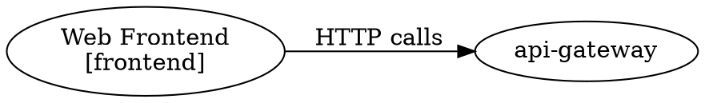

## Beschreibung

`export-diagram` currently supports PlantUML C4 and Mermaid C4. This feature adds three new formats: **GraphViz DOT** (classic graph rendering), **D2** (modern diagram DSL), and an **interactive HTML5 viewer** (self-contained, no external tools required).

## Motivation

- **DOT:** GraphViz is ubiquitous, available in most CI environments, and renders well for dependency graphs
- **D2:** Modern, actively maintained, growing ecosystem, cleaner syntax than DOT
- **HTML5:** Shareable single-file viewer that works offline — no draw.io, no PlantUML server needed; useful for sending to stakeholders

## Proposed Implementation

Extension of the existing `export-diagram` command:

```
bausteinsicht export-diagram --format dot|d2|html [--view <key>] [--output <dir>]
```

**DOT output** (graphviz):


**D2 output:**
```d2
direction: right
web-frontend: Web Frontend { style.fill: "#dae8fc" }
web-frontend -> api-gateway: HTTP calls
```

**HTML5 output:**
- Self-contained single `.html` file (no CDN, works offline)
- Interactive: pan/zoom, click-to-show-details, search/highlight, view selector
- Embeds model as JSON; pure JS SVG renderer (< 20 KB, no d3.js)

**Color consistency:** All formats share the same kind→color mapping defined once in `internal/diagram/colors.go`.

## Implementation Plan

See [`docs/plans/2026-03-18-additional-export-formats.md`](../plans/2026-03-18-additional-export-formats.md)

## Affected Components

- `internal/diagram/dot.go` (new)
- `internal/diagram/d2.go` (new)
- `internal/diagram/html.go` (new)
- `internal/diagram/colors.go` (new, extracted)
- `cmd/bausteinsicht/export_diagram.go` (extend `--format` flag)
