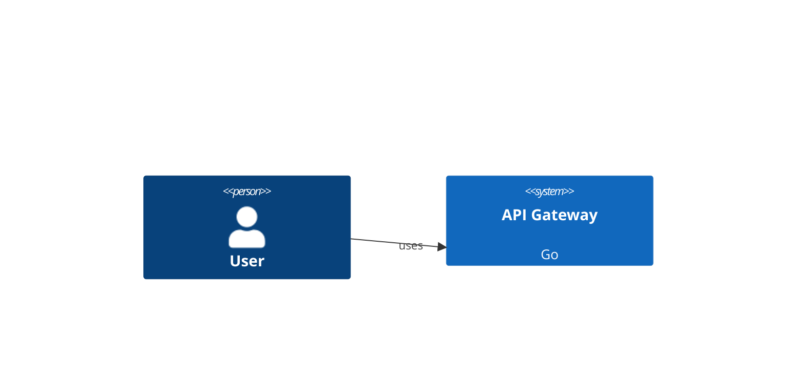

## Beschreibung

Extend `watch` and `sync` to export a Mermaid C4 diagram file (`architecture.md`) on every model change. The file renders natively in GitHub, GitLab, VS Code, and Obsidian — enabling instant architecture preview in the repository browser without draw.io.

## Motivation

- draw.io files are binary (XML) and do not render in GitHub/GitLab file browsers
- Architects sharing a repo link want to see the architecture without installing draw.io
- Mermaid is natively supported in GitHub Markdown since 2022 — no plugins needed
- The existing `export-diagram --format mermaid` command requires manual invocation; `watch --mermaid` automates it on every change
- Committing `architecture.md` makes the architecture visible in PRs and code reviews

## Proposed Implementation

**Extension of existing commands:**
```
bausteinsicht watch --mermaid [--mermaid-output architecture.md]
bausteinsicht sync  --mermaid [--mermaid-output architecture.md]
```

**Or via model config:**
```jsonc
{ "meta": { "mermaidExport": { "enabled": true, "output": "docs/architecture.md" } } }
```

**Output:** single Markdown file with one Mermaid diagram block per view:
````markdown
## Context View


````

**C4 level auto-detection:** `C4Context` / `C4Container` / `C4Component` based on view scope.

**Watch integration:** Mermaid export runs after every successful draw.io sync; skipped if sync fails.

## Implementation Plan

See [`docs/plans/2026-03-18-mermaid-live-preview-hook.md`](../plans/2026-03-18-mermaid-live-preview-hook.md)

## Affected Components

- `internal/diagram/mermaid_c4.go` — extend with C4 level detection
- `internal/diagram/markdown.go` — multi-view Markdown wrapper (new)
- `internal/watcher/watcher.go` — post-sync Mermaid hook
- `cmd/bausteinsicht/sync.go` + `watch.go` — `--mermaid` flag
