# Plan: Additional Export Formats (GraphViz DOT, D2, HTML5)

## Purpose

Extend `export-diagram` with three new output formats: GraphViz DOT (for classic graph rendering), D2 (modern diagram DSL), and an interactive HTML5 viewer (no external tools required, shareable as a single file).

## CLI Interface

Extension of the existing `export-diagram` command:

```
bausteinsicht export-diagram [--view <key>] [--format plantuml|mermaid|dot|d2|html] [--output <dir>]
```

New `--format` values:

| Format | Output file | Tool required |
|--------|------------|---------------|
| `dot` | `architecture-<view>.dot` | GraphViz (`dot` CLI) for rendering |
| `d2` | `architecture-<view>.d2` | D2 CLI for rendering |
| `html` | `architecture-<view>.html` | None — self-contained viewer |

## GraphViz DOT Format

### Example Output



```dot
digraph "Context View" {
  rankdir=LR
  node [shape=box style=filled fontname="Arial"]

  "web-frontend"     [label="Web Frontend\n[frontend]"    fillcolor="#dae8fc"]
  "api-gateway"      [label="API Gateway\n[service]"      fillcolor="#d5e8d4"]
  "order-service"    [label="Order Service\n[service]"    fillcolor="#d5e8d4"]
  "message-broker"   [label="Message Broker\n[infra]"     fillcolor="#ffe6cc"]

  "web-frontend"   -> "api-gateway"    [label="HTTP calls"]
  "api-gateway"    -> "order-service"  [label="routes to"]
  "order-service"  -> "message-broker" [label="publishes events"]
}
```

Colors are derived from element kind — same palette as draw.io forward sync.

## D2 Format

D2 is a modern diagram language with clean syntax and active development.

### Example Output

```d2
direction: right

web-frontend: Web Frontend {
  shape: rectangle
  style.fill: "#dae8fc"
}
api-gateway: API Gateway {
  shape: rectangle
  style.fill: "#d5e8d4"
}
order-service: Order Service {
  shape: rectangle
  style.fill: "#d5e8d4"
}

web-frontend -> api-gateway: HTTP calls
api-gateway -> order-service: routes to
```

## HTML5 Interactive Viewer

A self-contained single HTML file with embedded JavaScript (no CDN, no external dependencies) that renders an interactive diagram with:

- Pan and zoom
- Click on element → show details panel (description, technology, tags)
- Search bar to highlight elements
- View selector if multiple views are included

### Implementation Approach

The HTML file embeds:
1. A minimal SVG-based renderer (pure JS, < 20 KB)
2. The model data as an embedded JSON blob
3. Layout computed via simple force-directed or hierarchical algorithm

No external dependencies (no d3.js, no mxgraph) — the file must be fully self-contained and work offline.

### Example Skeleton

```html
<!DOCTYPE html>
<html>
<head><title>Architecture — Context View</title></head>
<body>
<script>
const MODEL = { /* embedded JSON */ };
// minimal SVG renderer
</script>
</body>
</html>
```

## Architecture

### New / Modified Files

| File | Change |
|------|--------|
| `internal/diagram/dot.go` | New: `RenderDOT(view, model, spec) string` |
| `internal/diagram/d2.go` | New: `RenderD2(view, model, spec) string` |
| `internal/diagram/html.go` | New: `RenderHTML(views []view, model, spec) string` |
| `internal/diagram/colors.go` | New (extracted): shared kind→color mapping used by all renderers |
| `cmd/bausteinsicht/export_diagram.go` | Extend `--format` flag with `dot`, `d2`, `html` cases |

### Color Mapping

To ensure consistency across all export formats, element kind colors are defined once in `colors.go`:

```go
var DefaultKindColors = map[string]KindStyle{
    "person":    {Fill: "#dae8fc", Stroke: "#6c8ebf"},
    "system":    {Fill: "#f5f5f5", Stroke: "#666666"},
    "service":   {Fill: "#d5e8d4", Stroke: "#82b366"},
    "frontend":  {Fill: "#dae8fc", Stroke: "#6c8ebf"},
    "database":  {Fill: "#fff2cc", Stroke: "#d6b656"},
    "infra":     {Fill: "#ffe6cc", Stroke: "#d6b656"},
}
```

Users can override colors in the `spec` section.

## Testing

- Unit tests for `RenderDOT` and `RenderD2` with snapshot comparison
- HTML render test: valid HTML5 structure, embedded model JSON parseable
- E2E test: `export-diagram --format dot` → output file exists and contains expected element IDs
- Test: `export-diagram --format html` with multiple views → all views present in single file

## Migration

Fully additive — existing `plantuml` and `mermaid` formats are unchanged.
