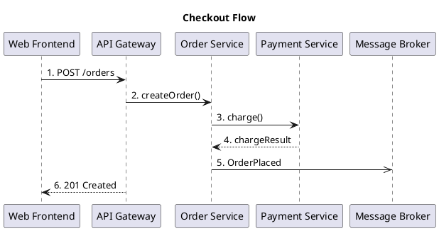
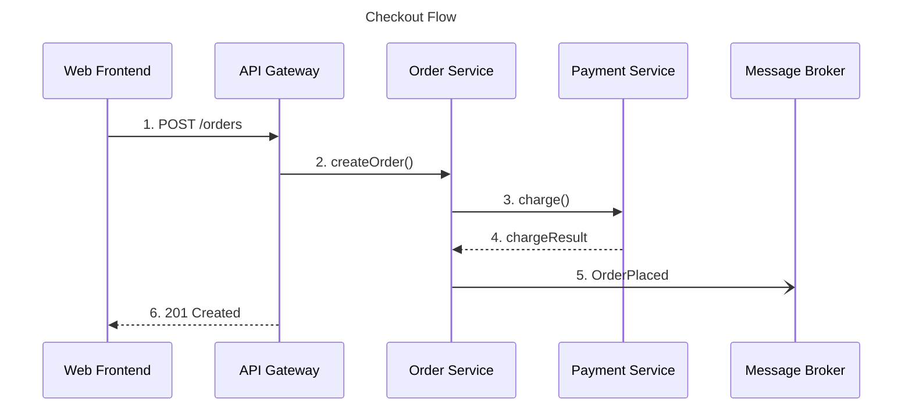

# Plan: Dynamic Views / Sequence Diagrams

## Purpose

Extend the model with dynamic views that describe call flows and message sequences between elements. Export to PlantUML or Mermaid sequence diagrams. Fills the gap between structural (component) and behavioral (sequence) architecture documentation.

## CLI Interface

```
bausteinsicht export-sequence [--model <file>] [--view <key>] [--format plantuml|mermaid] [--output <dir>]
```

| Flag | Default | Description |
|------|---------|-------------|
| `--model` | `architecture.jsonc` | Model file path |
| `--view` | (all dynamic views) | Export only one dynamic view |
| `--format` | `plantuml` | Output format |
| `--output` | `.` | Output directory |

## Model Changes

```jsonc
{
  "spec": { ... },
  "model": { ... },
  "views": [...],
  "dynamicViews": [
    {
      "key": "checkout-flow",
      "title": "Checkout Flow",
      "description": "Shows the sequence of calls during order checkout.",
      "steps": [
        { "index": 1, "from": "web-frontend", "to": "api-gateway",    "label": "POST /orders",   "type": "sync"  },
        { "index": 2, "from": "api-gateway",  "to": "order-service",  "label": "createOrder()",  "type": "sync"  },
        { "index": 3, "from": "order-service","to": "payment-service", "label": "charge()",       "type": "sync"  },
        { "index": 4, "from": "payment-service","to": "order-service", "label": "chargeResult",   "type": "return"},
        { "index": 5, "from": "order-service","to": "message-broker",  "label": "OrderPlaced",    "type": "async" },
        { "index": 6, "from": "api-gateway",  "to": "web-frontend",   "label": "201 Created",    "type": "return"}
      ]
    }
  ]
}
```

### Step Fields

| Field | Required | Description |
|-------|----------|-------------|
| `index` | yes | Ordering number (displayed as step label) |
| `from` | yes | Element ID (must exist in `model.elements`) |
| `to` | yes | Element ID |
| `label` | yes | Description of the message/call |
| `type` | no | `sync` (default), `async`, `return` |

## Export Output

### PlantUML



Arrow styles: `->` sync, `->>` async, `-->` return.

### Mermaid



## Architecture

### New / Modified Files

| File | Change |
|------|--------|
| `internal/model/types.go` | Add `DynamicView`, `SequenceStep` types; add `DynamicViews []DynamicView` to `BausteinsichtModel` |
| `internal/model/validate.go` | Validate step `from`/`to` reference existing element IDs; validate `index` uniqueness per view |
| `internal/diagram/sequence.go` | New: `RenderPlantUML(view DynamicView, model Model) string` and `RenderMermaid(...)` |
| `cmd/bausteinsicht/export_sequence.go` | New `export-sequence` command |

### Data Types

```go
type DynamicView struct {
    Key         string         `json:"key"`
    Title       string         `json:"title"`
    Description string         `json:"description,omitempty"`
    Steps       []SequenceStep `json:"steps"`
}

type StepType string
const (
    StepSync   StepType = "sync"
    StepAsync  StepType = "async"
    StepReturn StepType = "return"
)

type SequenceStep struct {
    Index int      `json:"index"`
    From  string   `json:"from"`
    To    string   `json:"to"`
    Label string   `json:"label"`
    Type  StepType `json:"type,omitempty"`
}
```

## Validation Rules

1. `from` and `to` must reference element IDs that exist in `model.elements`
2. `index` values must be unique within a view
3. At least one step per dynamic view
4. `type` must be one of `sync`, `async`, `return` (or omitted → default `sync`)

## Output File Naming

- PlantUML: `sequence-<view-key>.puml`
- Mermaid: `sequence-<view-key>.md`

## Testing

- Unit tests for `RenderPlantUML` and `RenderMermaid` with expected string output
- Validation tests for invalid element references
- E2E test: model with dynamic view → export → check output file content
