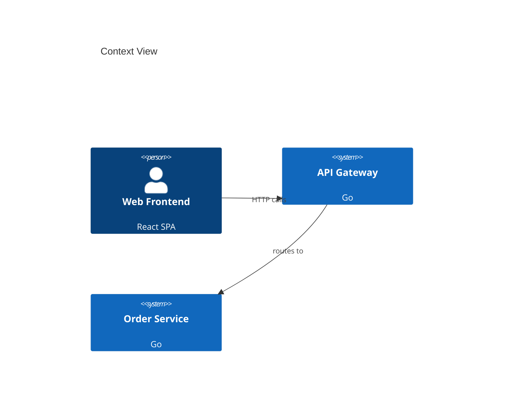

# Plan: Mermaid Live-Preview Hook in Watch Mode

## Purpose

Extend `watch` mode to export a Mermaid diagram file (`architecture.md`) on every model change. The file renders natively in GitHub, GitLab, VS Code, and Obsidian — enabling instant architecture preview without draw.io, directly in the repository browser.

## CLI Interface

No new command. Extension of existing `watch` and `sync` commands:

```
bausteinsicht watch  [--mermaid] [--mermaid-output <file>]
bausteinsicht sync   [--mermaid] [--mermaid-output <file>]
```

| Flag | Default | Description |
|------|---------|-------------|
| `--mermaid` | false | Enable Mermaid export alongside draw.io sync |
| `--mermaid-output` | `architecture.md` | Output file for Mermaid diagrams |

Alternatively: configure in model metadata:

```jsonc
{
  "meta": {
    "mermaidExport": {
      "enabled": true,
      "output": "docs/architecture.md",
      "views": ["context", "containers"]   // optional: limit to specific views
    }
  }
}
```

## Output Format

The output file contains one Mermaid diagram per view, wrapped in a Markdown document:

```markdown
# Architecture Diagrams

> Auto-generated by bausteinsicht — do not edit manually.
> Last updated: 2026-03-18T14:32:00Z

## Context View



## Containers View

```mermaid
C4Container
  title Containers View
  ...
```
```

## C4 Level Detection

Mermaid C4 has four diagram types: `C4Context`, `C4Container`, `C4Component`, `C4Dynamic`. The correct type is auto-detected from the view scope:

| View Scope | Mermaid Type |
|-----------|-------------|
| No scope (top-level) | `C4Context` |
| Scope = `system` kind | `C4Container` |
| Scope = `container` kind | `C4Component` |
| Dynamic view | `C4Dynamic` |

## Watch Mode Integration

When `--mermaid` is active, `watch` adds a Mermaid export step after each successful sync:

```
[14:32:01] Change detected: architecture.jsonc
[14:32:01] Syncing to draw.io...    ✅ (12 elements, 8 relationships)
[14:32:01] Exporting Mermaid...     ✅ architecture.md (3 views)
```

The Mermaid export runs only when the draw.io sync succeeds. If sync fails, the Mermaid file is not updated (avoids stale output).

## `.gitignore` Recommendation

`bausteinsicht init` adds an optional comment:

```
# Uncomment to exclude generated Mermaid file from git (if using draw.io as source of truth):
# architecture.md
```

Most teams will want to commit `architecture.md` to enable GitHub/GitLab rendering.

## Architecture

### New / Modified Files

| File | Change |
|------|--------|
| `internal/diagram/mermaid_c4.go` | Extend existing Mermaid renderer with C4 level detection and full model rendering (currently only handles structural views) |
| `internal/diagram/markdown.go` | New: wrap multiple Mermaid diagrams in a Markdown document |
| `internal/watcher/watcher.go` | Add post-sync hook for Mermaid export when `--mermaid` flag set |
| `cmd/bausteinsicht/sync.go` | Add `--mermaid` and `--mermaid-output` flags |
| `cmd/bausteinsicht/watch.go` | Add `--mermaid` and `--mermaid-output` flags |

## Testing

- Unit test: C4 level detection for each view scope type
- Unit test: multi-view Markdown output contains correct section headers
- Unit test: Mermaid file is not written when sync fails
- E2E test: `sync --mermaid` → `architecture.md` contains valid Mermaid syntax
- Test: `mermaidExport.views` filter limits output to specified view keys
